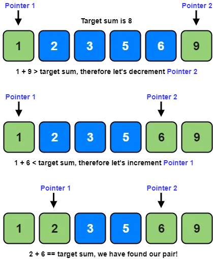
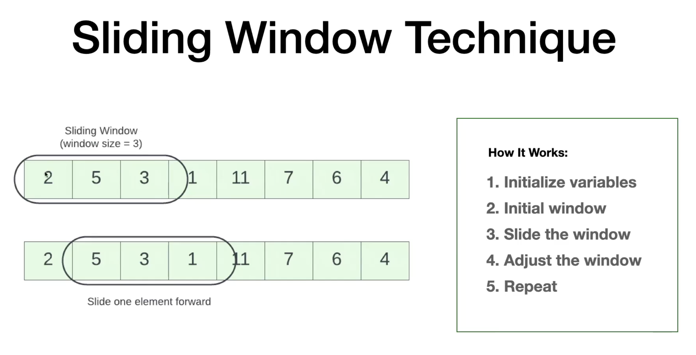

# Two pointer

Two pointer technique is a strategy that uses to indices to traverse a data structure in a specific manner to achieve an optimized solution.
This technique is particularly useful for problems involving searching, sorting, or finding pairs that satisfy certain conditions.

## Types of Two-Pointer Techniques

1. Opposite ends (Left-Right)
2. Same Direction (Fast-Slow)
3. Sliding Widow
4. Bidirectional Expansion

### Choosing the Right Two-Pointer Technique
| Problem Type                           | Recommended Technique 2 |
|----------------------------------------|-------------------------|
| Sorted arrays with sum/pair problems   | Opposite Ends           |
| Searching, sorting or partitioning     | Fast-Slow               |
| Finding substrings/subarrays           | Sliding Window          |
| Expanding from a center	             | Bidirectional Expansion |
                    
## Opposite ends (Left-Right)
In this approach both the pointers will be placed at opposite ends and moving them towards each other. It is useful when dealing with sorted arrays or problems requiring pair based solutions

### Examples
[Two sum](oppositeEnds/twoSum.js) 
    

    
Note: This works with sorted arrays only

## Same direction (Fast-Slow)
In this technique both the pointers move in the same direction but at different speeds. 

### Examples
[Remove duplicates](sameDirection/removeDuplicatesSorted.js)

### Sliding Window
In this technique one pointer expands the window and the other shrinks depending on the condition.
[Max average sub array](slidingWindow/)
